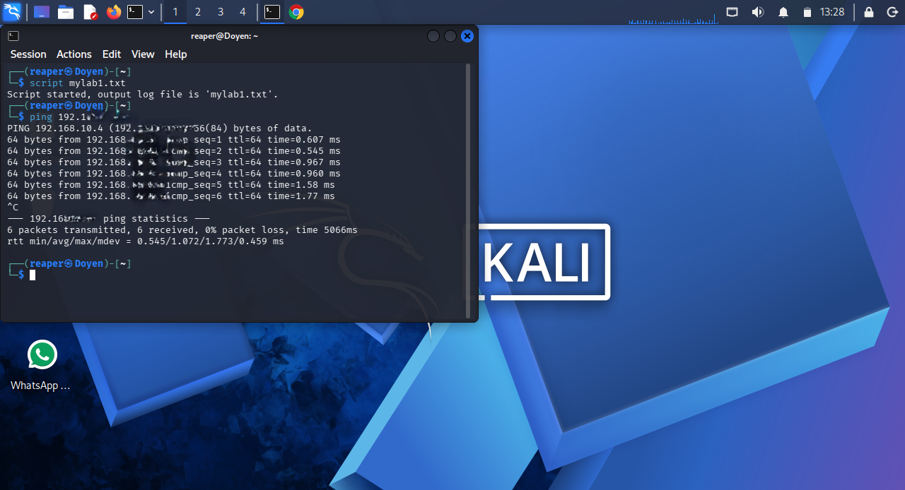

# Module 04 – Enumeration and Hydra Fundamentals

## Objective

This lab introduces the fundamentals of network enumeration and authentication concepts using a controlled cybersecurity lab environment.

## Lab Environment

| Role | System | IP Address |
|------|--------|------------|
| Attacker | Kali Linux | 192.168.x.x |
| Target | Metasploitable 2 | 192.168.x.x |

> Note: Internal IP addresses have been sanitized for security and privacy.

---

## Tools Used

- Kali Linux
- Nmap
- Nmap Scripting Engine (NSE)
- PostgreSQL
- SMB
- Linux Terminal

---

## Activities Performed

- Verified network connectivity
- Discovered open ports
- Identified running services
- Enumerated SMB user accounts
- Detected PostgreSQL service version
- Learned the concepts of credentials and wordlists

---

## Commands Covered

```bash
ping 192.168.x.x
```

```bash
nmap 192.168.x.x
```

```bash
nmap --script=smb-enum-users.nse -p 445 192.168.x.x
```

```bash
nmap -sV -p 5432 192.168.x.x
```

---

## Key Concepts

- Enumeration
- Open Ports
- Service Detection
- SMB
- PostgreSQL
- Credentials
- Wordlists

---

## Learning Outcome

This module demonstrated a structured approach to information gathering in an authorized lab environment, emphasizing the importance of identifying reachable hosts, open services, and exposed user information before planning authentication security testing.
---

# Evidence

## Figure 1 – Ping Connectivity Test



The ping test confirmed successful communication between the Kali Linux workstation and the Metasploitable target.

---

## Figure 2 – Nmap Port Scan


An Nmap scan identified multiple open services including SMB (445) and PostgreSQL (5432).

---

## Figure 3 – SMB User Enumeration


The SMB enumeration script identified several user accounts configured on the target system.

---

## Figure 4 – PostgreSQL Service Detection


Service version detection confirmed PostgreSQL was running on TCP port 5432.
